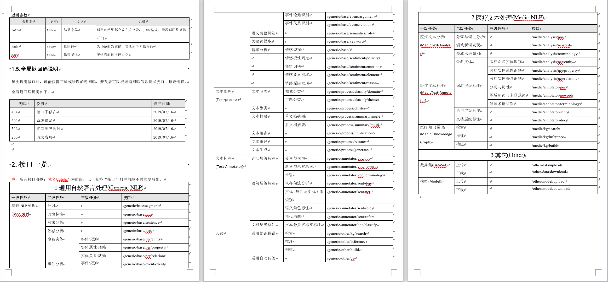

# 前端项目开发说明

## 基础配置

项目初始情况下数据都是开源与 Mock Sevice 的，新增接口需要在配置 vue.config.js 文件配置代理地址：

```js
devServer: {
    proxy: {
      '/api': {
        target: `http://127.0.0.1:${port}/mock`,
        changeOrigin: true,
        pathRewrite: {
          '^/api': ''
        }
      },
        // 增加以下配置
       // xxx修改为后台web模块地址
      '/api/xxx': {
        // 修改为后台web项目的地址端口
        target: `http://127.0.0.1:8888`,
        changeOrigin: true,
        pathRewrite: {
          '^/api/xxx': '/api/xxx'
        }
      }
    },after: require('./mock/mock-server.js')
  },
}
```

## 开发步骤

### 定义接口

在 src/api 目录下建立接口文件，以 article.js 为例，文件内容如下：

```js
import request from '@/utils/request'

export function fetchList(query) {
  return request({
    url: '/article/list', // 接口路径
    method: 'get', // 请求方法
    params: query // 参数
  })
}

export function deleteArticle(params) {
  return request({
    url: '/article',
    method: 'delete',
    params
  })
}
```

### 建立页面文件

在 src/views/moudles 下建立模块目录，目录建立后，新建页面文件，如：test/example.vue。
页面文件的基本框架入如下：

```html
<template>
  <div class="ax-page">
    <div class="query">
      <!-- 查询表单区域 -->
    </div>
    <div class="actions">
      <!-- 操作按钮区域 -->
    </div>
    <div class="data">
      <!-- 表格及分页区域 -->
    </div>
  </div>
</template>

<script>
  // 引用api防范
  import { xxx, yyy } from '@/api/xxx'
  export default {
    name: 'Example',
    // 引用的组件
    components: {},
    // 数据定义
    data() {},
    // 方法定义
    methods: {}
  }
</script>
<style lang="scss" scoped>
  //  样式定义
</style>
```

### 定义路由

在 src/router/modules 目录下建立路由文件，如 test.js。

```js
import Layout from '@/layout'

export default {
  path: '/test',
  component: Layout,
  redirect: 'noRedirect',
  name: 'Test',
  alwaysShow: true,
  meta: {
    title: '测试',
    icon: 'fa-bug'
  },
  children: [
    {
      path: 'test-page',
      component: () => import('@/views/modules/test/index'),
      name: 'TestPage',
      meta: { title: '测试页', icon: 'fa-bug' }
    },
    {
      path: 'example-page',
      component: () => import('@/views/modules/test/example'),
      name: 'ExamplePage',
      meta: { title: '示例页面', icon: 'fa-bug' }
    }
  ]
}
```

## 路由配置规范

路由配置与接口保持一致，api列表如下：



路由文件命名
``` 
命名格式为：
[主模块]-[二级模块]-[三级模块].js

如：通用自然语言处理-基础出路-命名实体
文件名为：genetic-base-ner.js

```

页面进行文档说明卸载可在叶子页面的 meta.helpInfo属性中，支持html格式，配置示例如下：

```js
 {
      path: 'example-page',
      component: () => import('@/views/modules/test/example'),
      name: 'ExamplePage',
      meta: { title: '示例页面', icon: 'fa-bug',helpInfo: ```
      这是帮助信息，<br> <h2>h2文本</h2>
      ``` }
}
```


